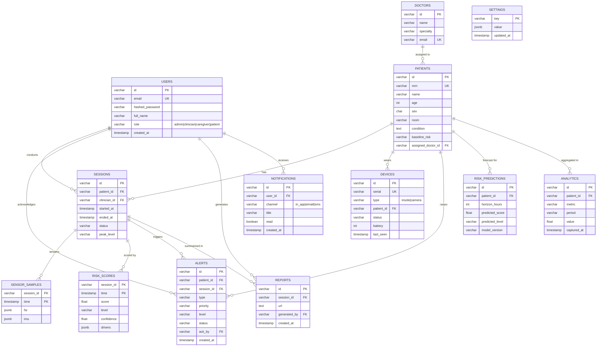

# GaitGuard — Data Model (ER Diagram)

PostgreSQL + TimescaleDB. Relational core for entities; hypertables for the
high-volume time-series (`sensor_samples`, `risk_scores`). Canonical DDL:
[`infra/schema.sql`](../infra/schema.sql).

## Indexes & constraints (highlights)

- **Unique**: `users.email`, `doctors.email`, `patients.mrn`, `devices.serial`.
- **Foreign keys** cascade from `patients` → `sessions` → `sensor_samples`/`risk_scores`/`reports`; `SET NULL` for optional staff links.
- **Check constraints** on enums (`role`, `sex`, `baseline_risk`, device `type`/`status`, alert `status`, notification `channel`).
- **Hypertables**: `sensor_samples`, `risk_scores` partitioned on `time`; continuous aggregate `risk_scores_1m` powers long-range trend queries.
- **Hot-path indexes**: `alerts(status)`, `alerts(patient_id)`, `sessions(patient_id)`, `notifications(user_id)`, `audit_log(ts)`.
